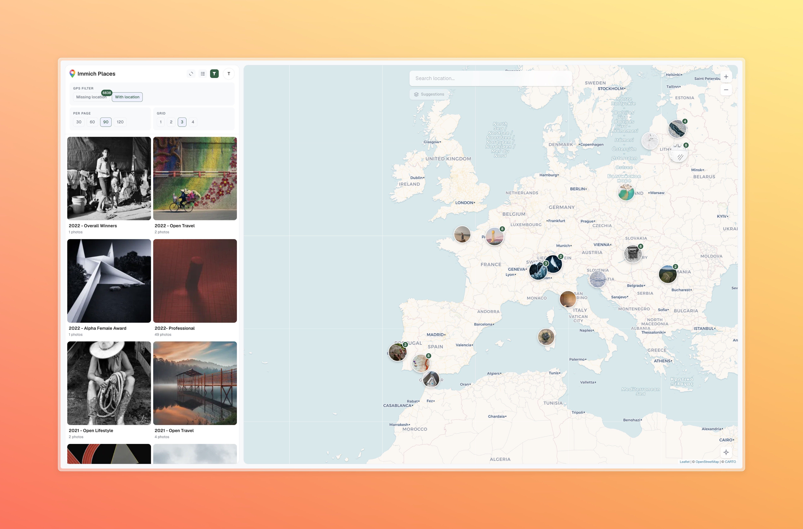

# Immich Places

Immich Places is an add-on web UI for existing Immich instances that helps you assign GPS coordinates to photos that are missing location data.



The app has two parts:

- Frontend: Next.js app (served on port `3032`) for map review, bulk selection, and location assignment.
- Backend: Go service that syncs metadata from Immich, stores local state in SQLite, and performs geocode/sync jobs.

## Why it exists

- Fix geolocation for older photos with missing GPS.
- Keep existing Immich users and albums in sync while you enrich missing coordinates.
- Run the workflow from a fast map + list interface instead of manual per-item workflows.

## Features

**Map & Location**

- Interactive map with clustered markers (Leaflet)
- Drag-and-drop a photo onto the map to assign coordinates
- Geocoding search (Nominatim/OpenStreetMap) with autocomplete and history
- Smart suggestions: locations from same-day, nearby-day, weekly patterns, frequent spots, and album context

**Photo Browsing**

- Virtualized photo grid with configurable columns and page size
- Filter by GPS status (missing / present / all) and by album
- Fullscreen lightbox with keyboard navigation
- Multi-select with shift+click for bulk operations

**Sync & Data**

- Background sync keeps assets up to date with Immich (configurable interval)
- Manual sync trigger from the UI
- Local SQLite database — no changes to Immich until you explicitly save
- Confirmation bar to review and save/cancel pending coordinate changes

## Prerequisites

- An existing Immich instance already running (local or remote).
- Docker and `docker compose` on the target host.
- A valid Immich API key for the user who will configure Immich Places.
- Access to a shell on the Immich Places host.

## 1) Copy env values

From this repo root, create `.env` with the values below:

```bash
cp .env.example .env
```

Then edit `.env`:

- `IMMICH_URL`: Base URL used by the backend to call your Immich API.
- `ENCRYPTION_KEY`: Random key used to encrypt stored Immich API keys in the local DB.
- `TRUST_PROXY_TLS`: Set to `true` when behind HTTPS reverse proxy (default behavior).
- `IMMICH_EXTERNAL_URL`: Optional, only when browser-facing Immich links differ from backend-to-Immich calls.

Example:

```bash
IMMICH_URL=http://immich-server:2283
ENCRYPTION_KEY=$(openssl rand -hex 32)
TRUST_PROXY_TLS=true
SYNC_INTERVAL_MS=300000
```

## 2) Run it

### Option A: Docker Compose (recommended)

From the repo root:

```bash
docker compose up -d --build
```

### Option B: Docker Hub images

```bash
docker network create immich-places-net

docker run -d --name immich-places-backend --network immich-places-net --env-file .env -v immich-places-data:/data majorfi/immich-places-backend

docker run -d --name immich-places --network immich-places-net -p 3032:3032 -e PORT=3032 -e BACKEND_URL=http://immich-places-backend:8082 majorfi/immich-places
```

Then open:

```text
http://localhost:3032
```

## 3) First run flow (fast path)

1. Register or log in to Immich Places.
2. On first login, provide your Immich API key when prompted.
3. Once the key is accepted, the map view opens automatically.
4. Wait for sync completion, then start correcting assets without GPS.

## Immich API key permissions required

Immich Places validates the key with `GET /api/users/me` and then calls:

- `GET /api/search/metadata` (read assets for sync/search)
- `GET /api/albums` and `GET /api/albums/{id}` (album listing and album contents)
- `GET /api/stacks` (stack synchronization)
- `PUT /api/assets` (bulk write updates when saving coordinates)
- `GET /api/assets/{id}/thumbnail` (asset preview thumbnails)

The following Immich permissions are required:

- `user.read`
- `asset.read`
- `asset.update`
- `asset.view`
- `album.read`
- `library.read` (if External Library is used)
- `stack.read`

## Required environment variables

- `IMMICH_URL` (required): Immich base URL visible from the backend container.
- `ENCRYPTION_KEY` (required): Must be stable across restarts; changing it will make stored keys unreadable.
- `TRUST_PROXY_TLS` (required unless insecure mode): Must match your deployment TLS posture.
- `ALLOW_INSECURE` (optional): Set to `true` only for local non-HTTPS testing.

## Optional environment variables

- `IMMICH_EXTERNAL_URL` (optional): Public Immich URL for link generation/fallback behavior.
- `FRONTEND_PORT` (default `3032`): Frontend port exposed to the host.
- `REGISTRATION_ENABLED` (default `true`): Set to `false` to disable new users.
- `SYNC_INTERVAL_MS` (default `300000`): Background sync frequency.
- `DATA_DIR` (default `/data`): Backend DB path inside container.
- `PORT` (default `8082`): Backend listen port inside container.
- `BACKEND_URL` (frontend): Backend service URL used by the Next.js rewrite, default is `http://backend:8082`.
- `NEXT_PUBLIC_BACKEND_BASE` (frontend): Client API base path, default `/api/backend`.

## Existing Immich user tips

- For a containerized Immich stack, point `IMMICH_URL` at the Immich service name.
- For remote Immich behind HTTPS, use `https://...` directly in `IMMICH_URL`.
- You can disable registration (`REGISTRATION_ENABLED=false`) once your admin account exists.
- First sync may take longer on large libraries. Check service logs if anything stalls.

## Health and troubleshooting

- Frontend logs: `docker compose logs -f frontend`
- Backend logs: `docker compose logs -f backend`
- If startup fails on `ENCRYPTION_KEY`, confirm `.env` is in the project root and contains the key.

## Security usage note

As with any software, there may still be bugs, edge-case errors, or incomplete hardening details.
We aim to keep behavior safe, stable, and security-aware, but no software is perfect.
We used AI models as a drafting and review aid during implementation.  
It was not vibe-coded. Design decisions major part of the implementation were still done by a human.

Use this project at your own risk.
